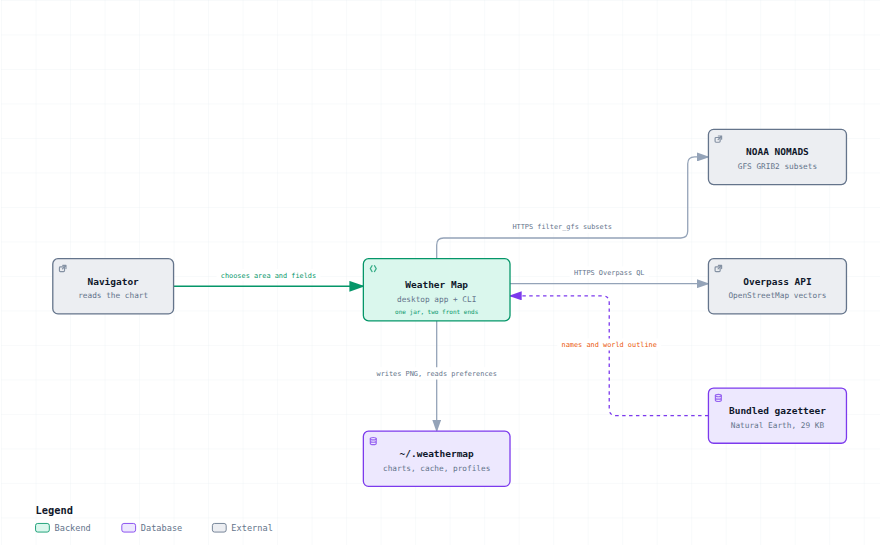
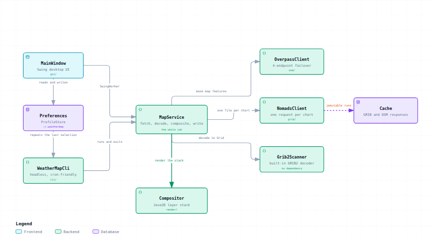
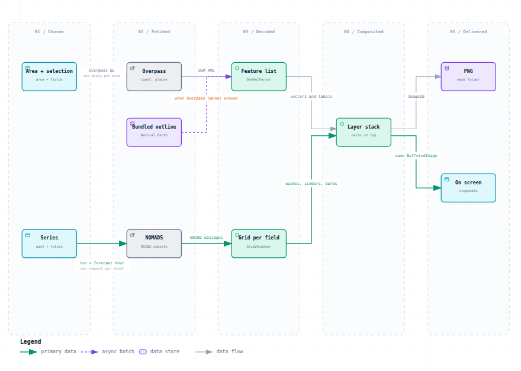
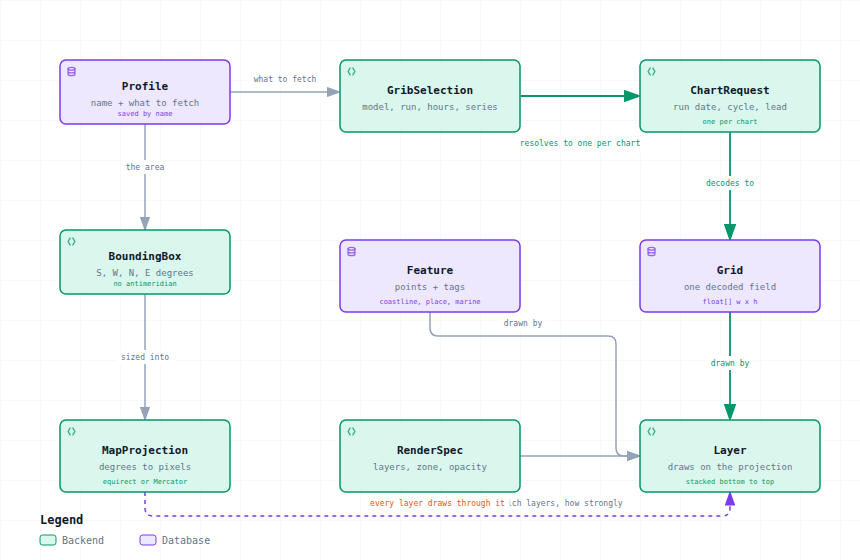
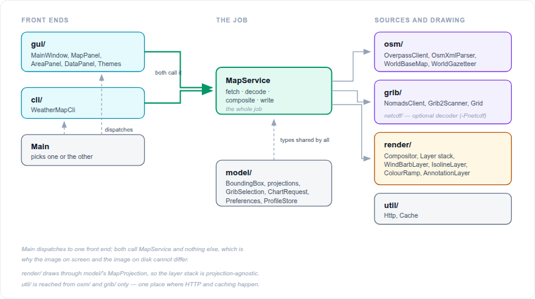

# All four diagrams

The same diagrams as the individual pages, on one page, as raster images. This
is the page the in-application Help window shows, because Swing renders HTML 3.2
and cannot draw SVG.

For the crisp versions, and for the interactive viewers with search, focus and
relationship tracing, see the [individual pages](README.md).

## C4 Level 1 — System context

What the application talks to, and what it does without a network.

## C4 Level 2 — Containers

The two front ends, the one pipeline, and where state lives.

## Chart pipeline

How an area and a selection become a PNG.

## Data structures

The model types and how they relate.

## Package layout

Which package holds what, and which depends on which.

